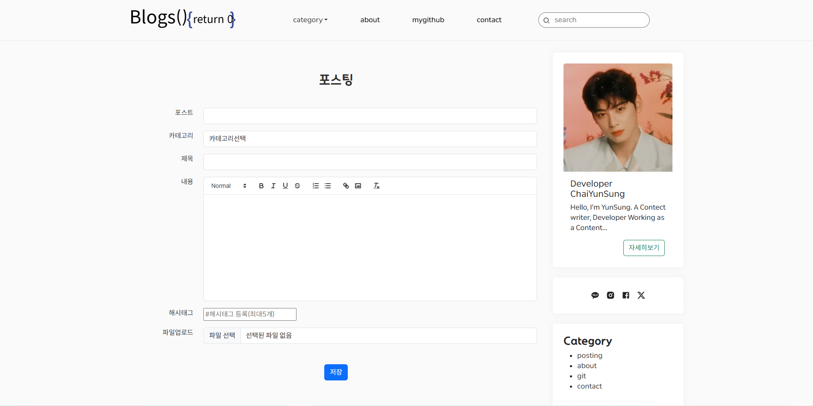
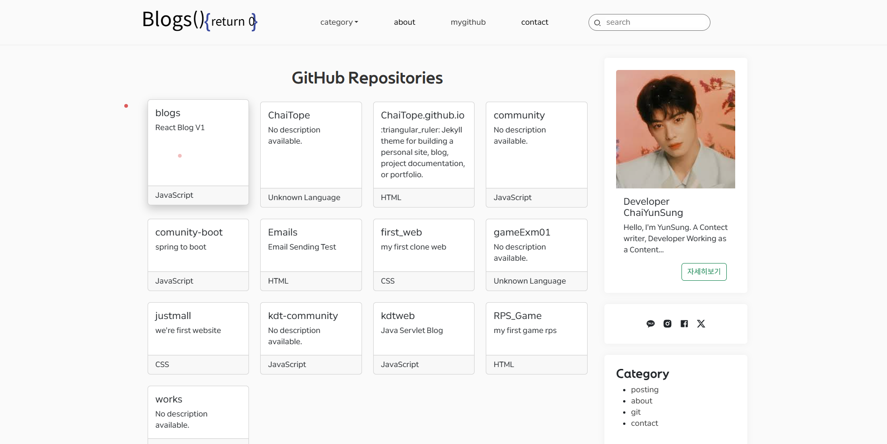
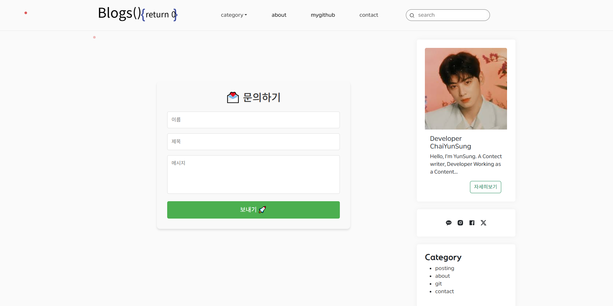

# 📝 Blog Project

## 1. 📖 프로젝트 개요

- **목적**: REACT와 Spring-Boot를 이용한 개인 블로그 시스템 개발 및 포트폴리오 활용
- **주요 기능**:
  - 사용자 인증 (외부 API 사용 로그인)
  - 블로그 포스트 작성 및 이미지 업로드
  - 댓글 시스템
  - 포스트 카테고리 및 태그 관리
  - 검색 및 필터링 기능
  - 반응형 디자인 지원

---

## 2. 🔧 기술 스택

### 🛠 개발 도구

- **IDE**: IntelliJ IDEA, VS Code
- **버전 관리**: Git, GitHub

### 🎨 프론트엔드

- React, Redux, Bootstrap
- Axios, HTML5, CSS3, JavaScript (ES6)

### 🔙 백엔드

- Node.js, Express
- RESTful API 설계
- JSON Web Token (JWT)을 활용한 인증

### 🗄 데이터베이스

- MySQL

### 🤝 협업 및 테스트 도구

- Postman
- GitHub

---

## 3. 📜 주요 기능

### 사용자 기능

- 🔑 **회원가입 및 로그인**
  - 이메일 인증 및 JWT 기반 로그인
- 💬 **댓글 시스템**
  - 로그인 시 댓글 작성 가능
- 🔍 **이메일 발송**
  - Contact탭 이용시 제작자에게 이메일 발송 가능
- 📱 **반응형 디자인**
  - 모바일, 태블릿, PC 환경에 최적화된 UI

### 관리자 기능

- ✍️ **포스트 관리**
  - 포스트 작성 및 이미지 업로드

---

## 4. 🖼️ 화면 예시

| 화면 설명      | 이미지                             |
| ------------- | --------------------------------- |
| **메인 페이지** |  |
| **포스트 페이지** |  |
| **소개 페이지** |     |
| **깃 모음 페이지** |     |
| **이메일 전송 페이지** |     |

---

## 5. 📐 아키텍처

- **MVC 패턴**: 코드 구조화 및 유지보수성 강화
- **REST API 설계**: 백엔드 엔드포인트를 통한 데이터 통신
- **MySQL 데이터베이스**: 정규화 및 관계형 데이터 관리

---

## 6. 📊 ERD

| ERD | 이미지 |
| --- | ------ |
| ERD |  |

---

## 7. 📅 프로젝트 일정 <!-- 임시로 작성해놓음 수정해야함 -->

| 주차  | 작업 내용                     |
| ----- | --------------------------- |
| 1주차 | 프로젝트 설계 및 환경 설정   |
| 2주차 | 사용자 인증 및 포스트 관리   |
| 3주차 | 댓글 시스템 및 검색 기능     |
| 4주차 | 테스트 및 최적화            |

---

## 8. ⚙️ 설치 및 실행

### 프론트엔드

1. `frontend.zip` 파일을 압축 해제합니다.
2. 아래 명령어로 의존성을 설치하고 실행합니다:

   ```bash
   cd frontend
   npm install
   npm start

### 백엔드

1. backend 폴더로 이동합니다.
2. 아래 명령어로 서버를 실행합니다:

    ```bash
    cd backend
    npm install
    npm run dev

### 데이터베이스

1. MySQL에 mysql.sql 파일을 실행하여 데이터베이스를 초기화합니다.

## 9. 🤝 개발 도구

- GitHub를 활용한 버전 관리 및 코드 리뷰
- Postman으로 API 테스트

## 10. 📌 참고 자료

- React 공식 문서: https://reactjs.org/
- MySQL 공식 문서: https://dev.mysql.com/